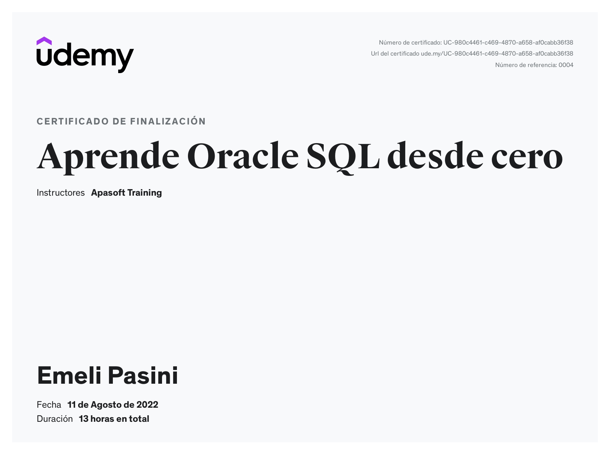

# Curso "Aprende Oracle SQL desde cero"

[Link al curso de Udemy](https://www.udemy.com/course/aprende-oracle-sql-desde-cero/)

### Ejercicios

- tablas_hr es el script para crear y poblar las tablas que se usan en los ejercicios.
- cars.sql es el script para crear y poblar las tablas que se usan en los ejercicios de conjuntos.

### Certificate

